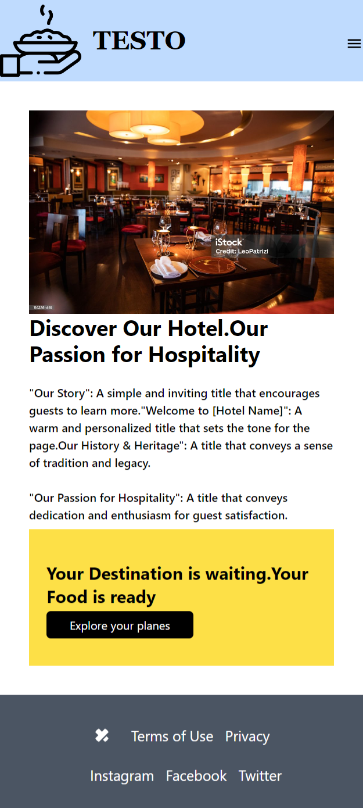

# TESTO (FOOD)
## Technologies Used
- HTML
- JAVASCRIPT
- REACT JS
- TAILWIND CSS

#  HOME PAGE

# ABOUT PAGE

# MENU PAGE
 

/admin
/admin/income
/admin/reviews
/admin/cars
/admin/cars/:id
/admin/cars/:id/pricing
/admin/cars/:id/photos
- 1 create admin link to the navbar that takes you to the /admin path
- 2 create following components in the pages /admin folder
- a Dashboard.js - /admin
- b Incom.js  - /admin/income
- c Review.js - /admin/reviews

 - q these components just can have an h1 for the function name 
 - q setUp routes for of these pages